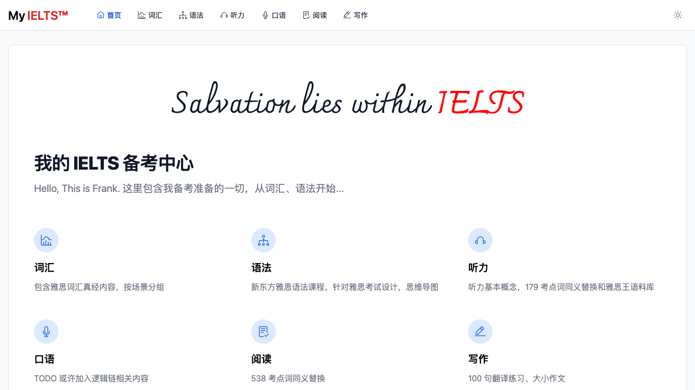
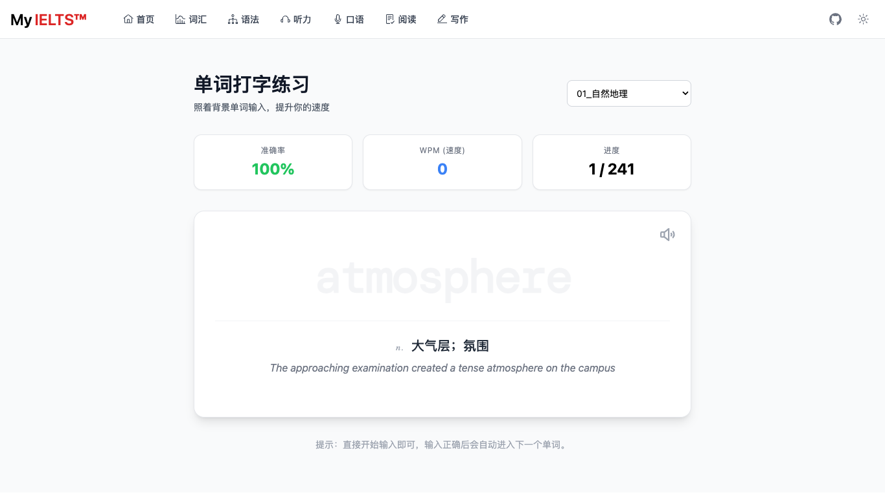
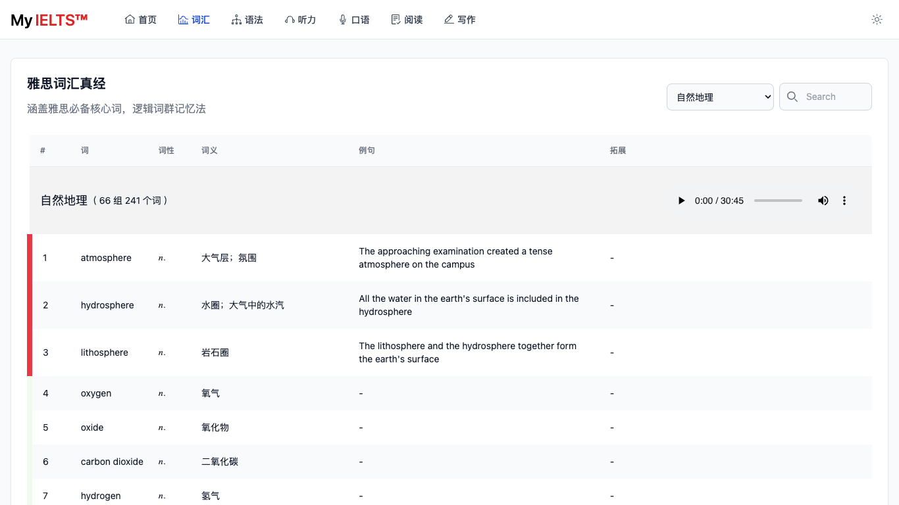
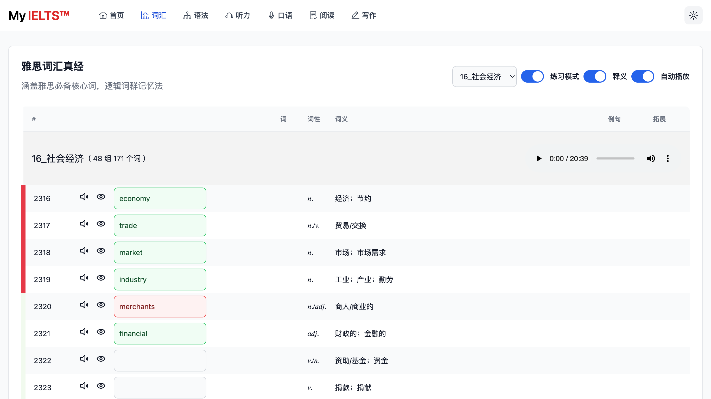
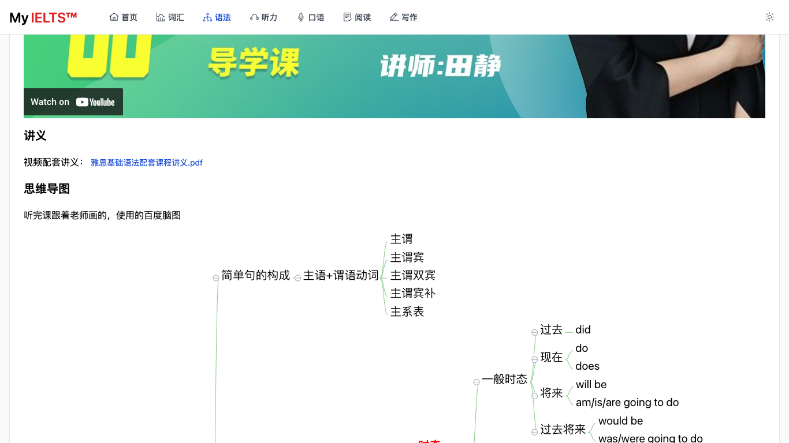
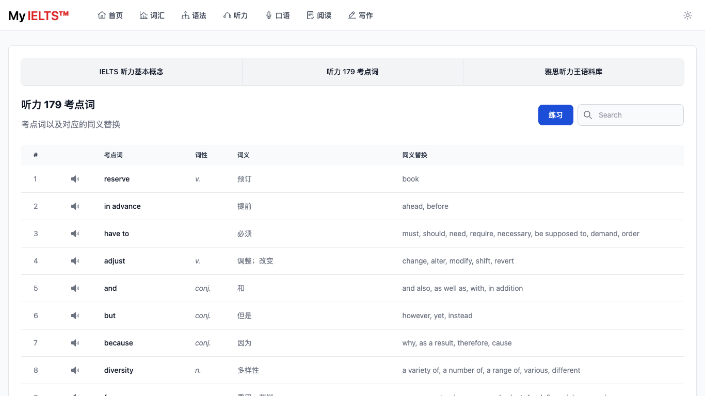
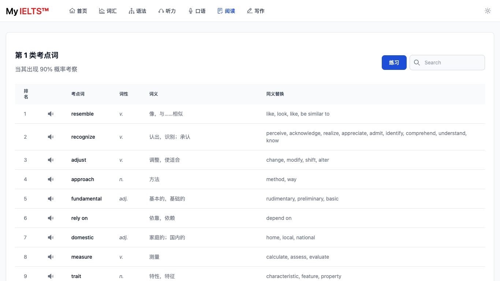
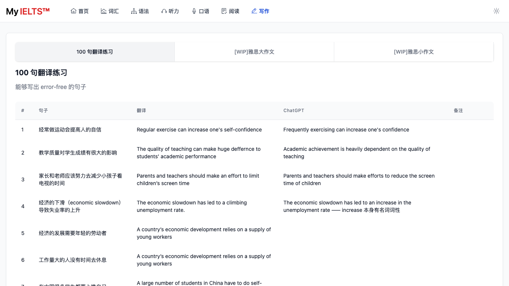

<p><br></p>

<picture>
  <source media="(prefers-color-scheme: dark)" srcset="public/salvation_lies_within_IELTS_dark.svg">
  <source media="(prefers-color-scheme: light)" srcset="public/salvation_lies_within_IELTS_light.svg">
  
</picture>

<p><br></p>
<p><br></p>
<h1 align='center'>
  My <span>IELTS™</span>
</h1>

<h2>在线地址 <a href="https://hefengxian.github.io/my-ielts/#/">https://hefengxian.github.io/my-ielts/</a></h2>

<picture>
  <source media="(prefers-color-scheme: dark)" srcset="public/screenshot/screenshot-home-dark.png">
  <source media="(prefers-color-scheme: light)" srcset="public/screenshot/screenshot-home-light.png">
  
</picture>


## 概述

雅思备考资料，包含词汇、语法、听说读写最出名的一些内容

- [x] 词汇练习模式

### 每日学习系统

项目在保留原有资料库的基础上，增加了面向中文学习者的每日学习路径：

- 首次进入完成 15 题基础测试，设置目标分数与每日学习时间
- 根据当前阶段自动生成 30 / 45 / 60 / 90 分钟的每日任务
- 课程使用 Day 进度，不会因中断几天而自动跳课
- 词汇支持“认识 / 模糊 / 不认识”和简单间隔复习
- 语法、听力、阅读自动判分并将错题加入复习
- 写作支持计时、字数统计和本地草稿，不调用 AI
- 学习数据保存在浏览器，可导入、导出 JSON
- 可选 Supabase 邮箱登录，在手机和电脑之间同步同一份进度

原有词汇、语法、听力、阅读和写作内容统一保留在“资源库”。

### 发布到 GitHub Pages

项目包含 `.github/workflows/deploy-pages.yml`。上传到自己的 GitHub 仓库后，在仓库的 `Settings → Pages` 中把发布来源设为 `GitHub Actions`；之后推送到 `main` 或 `master` 分支会自动构建并发布。Vite 会根据仓库名称自动设置站点路径，无需手动修改用户名或仓库名。

### 配置跨设备同步

未配置 Supabase 时，项目会继续使用原有本地模式，不影响学习功能。需要跨设备同步时，请按照 [`docs/cloud-sync-setup.md`](docs/cloud-sync-setup.md) 创建数据表、启用权限并配置环境变量。切勿把 Supabase `service_role` 密钥放入前端或 GitHub 变量；本项目只使用可公开的 Publishable Key，并依靠 RLS 隔离用户数据。

## 规划栏目

### 词汇

> 2026-03 增加打字练习模式，感谢 [@Tommy1109255](https://github.com/Tommy1109255)

<picture>
  <source media="(prefers-color-scheme: dark)" srcset="public/screenshot/typing-vocabulary-dark.png">
  <source media="(prefers-color-scheme: light)" srcset="public/screenshot/typing-vocabulary-light.png">
  
</picture>

雅思词汇真经（刘洪波橙色的那本）

- 雅思核心词汇
- 逻辑词群记忆法
- 原书音频

词列表

<picture>
  <source media="(prefers-color-scheme: dark)" srcset="public/screenshot/screenshot-vocabulary-dark.png">
  <source media="(prefers-color-scheme: light)" srcset="public/screenshot/screenshot-vocabulary-light.png">
  
</picture>

练习模式

<picture>
  <source media="(prefers-color-scheme: dark)" srcset="public/screenshot/screenshot-vocabulary-training-mode-dark.png">
  <source media="(prefers-color-scheme: light)" srcset="public/screenshot/screenshot-vocabulary-training-mode-light.png">
  
</picture>

### 语法

新东方雅思语法

- 视频
- 讲义
- 思维导图

<picture>
  <source media="(prefers-color-scheme: dark)" srcset="public/screenshot/screenshot-grammar-dark.png">
  <source media="(prefers-color-scheme: light)" srcset="public/screenshot/screenshot-grammar-light.png">
  
</picture>

### 听力

了解雅思听力，以及考试中的一些基本原则、技巧

- 基本概念和应试技巧
- 听力 179 考点词
- [WIP] 雅思听力王语料库

<picture>
  <source media="(prefers-color-scheme: dark)" srcset="public/screenshot/screenshot-listening-dark.png">
  <source media="(prefers-color-scheme: light)" srcset="public/screenshot/screenshot-listening-light.png">
  
</picture>

### 口语

TODO

### 阅读

- 538 考点词同义替换

<picture>
  <source media="(prefers-color-scheme: dark)" srcset="public/screenshot/screenshot-reading-dark.png">
  <source media="(prefers-color-scheme: light)" srcset="public/screenshot/screenshot-reading-light.png">
  
</picture>


### 写作

写作相关内容，从基础开始

- 顾家北手把手教你雅思写作 V6.0 —— 100 句翻译练习

<picture>
  <source media="(prefers-color-scheme: dark)" srcset="public/screenshot/screenshot-writing-dark.png">
  <source media="(prefers-color-scheme: light)" srcset="public/screenshot/screenshot-writing-light.png">
  
</picture>

## 开发

本项目使用

- [Vitesse Lite](https://github.com/antfu/vitesse-lite) 作为模板开发
- 样式部分参照了 [Flowbite](https://github.com/themesberg/flowbite) & [Flowbite Admin Dashboard](https://flowbite-admin-dashboard.vercel.app)

所以需要对 Vue3、TailWindCSS 有一定的了解才能二次开发

```bash
# 安装依赖
pnpm i

# 开发模式
pnpm run dev

# 构建
pnpm run build
```

## 禁止将本项目用于任何商业目的！！！
